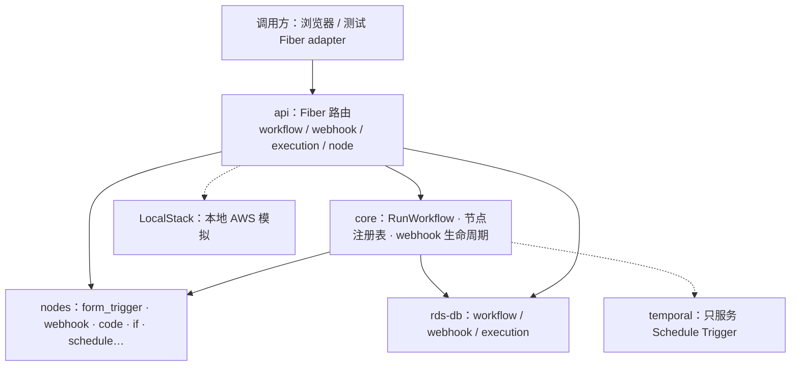
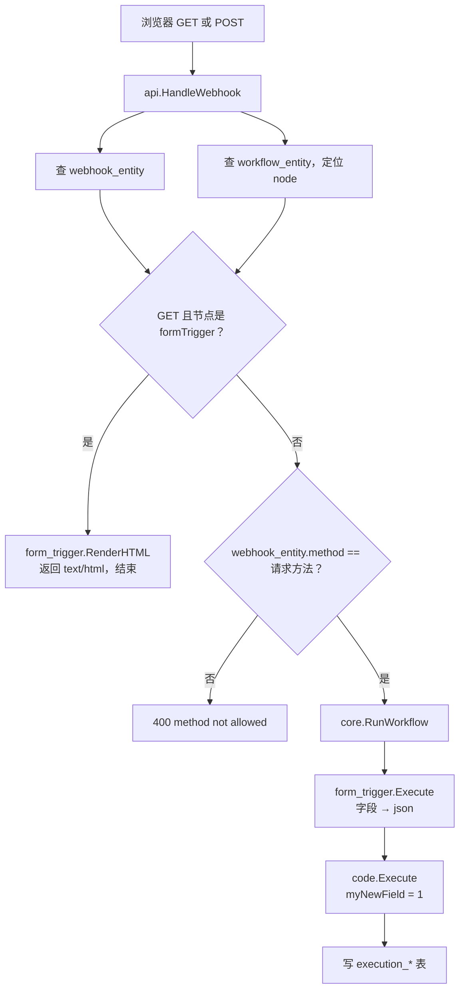
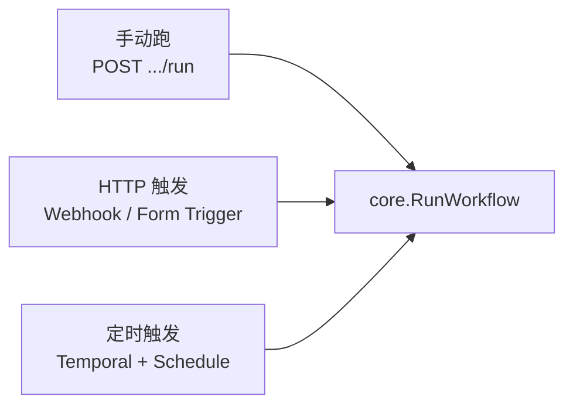
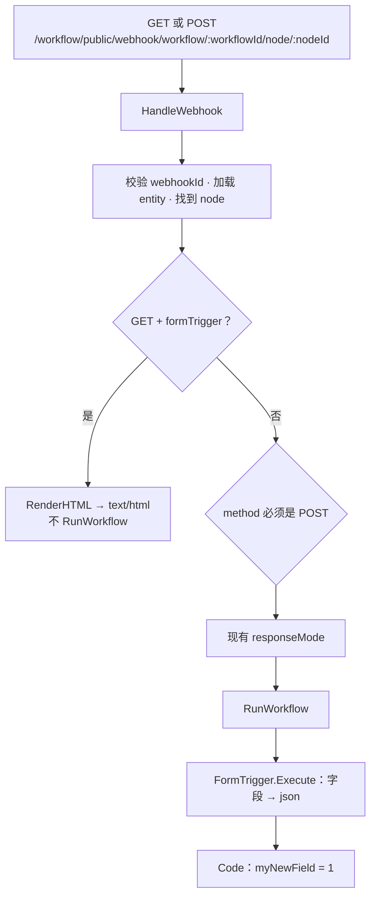

# Form Trigger Node 解题思路

面向讲解：为什么这样做、为什么正确、为什么改动小且高效。  
对应需求：`Suger Backend Project 1: Form Trigger Node`  
对应实现：`service/workflow_service/nodes/form_trigger/` + 复用 `api/webhook.go`

本文是对外讲解稿。第 1 节先梳理仓库分层，后面再讲 Form Trigger 怎么接到这条链路上。  
实现规格（字段、接口、测试矩阵）在  
[`docs/superpowers/specs/2026-08-14-form-trigger-node-design.md`](./superpowers/specs/2026-08-14-form-trigger-node-design.md)，两份互补，不互相覆盖。

---

## 0. 一句话结论

Form Trigger **不是一个新 API**，而是 Webhook Trigger 的一种特殊形态：

- **同一个 URL**
- **GET 只负责把配置渲染成 HTML 表单，绝不启动 workflow**
- **POST 才启动 workflow**，并把表单字段变成第一个节点的 json 输出

所以正确做法不是新开 `/form` 路由，而是：**顺着已经跑通的 Webhook 链路，只补「GET 渲染」和「POST 字段解析」两块差异。**

这就是本题最高效的解法：复用 90% 已有能力，只改真正缺的 10%。

---

## 1. 代码库怎么分层（答辩前先讲清这张图）

讲解时建议先花一分钟把仓库画出来，再进入 Form Trigger。  
老师会听出来：你不是只改了一个节点文件，而是知道请求从哪进来、数据存在哪、执行器怎么找到节点。

### 1.1 顶层目录

这是一个 **Go 单体仓库**，真正干活的业务在 `service/workflow_service/`。其余目录是它的依赖和本地环境。

| 目录 | 一句话 | 本题要不要深入 |
| --- | --- | --- |
| `service/workflow_service/api/` | HTTP 入口：Fiber 路由 + handler | **要**。Form Trigger 复用这里的 `HandleWebhook` |
| `service/workflow_service/core/` | 执行引擎：跑 workflow、注册节点、管 webhook 生命周期 | **要**。`getWebhookMethod` 决定注册成 GET 还是 POST |
| `service/workflow_service/nodes/` | 每个节点一个包，`init()` 注册进 core | **要**。本题主体是新包 `form_trigger/` |
| `service/workflow_service/nodes_test/` | 带 Docker 的工作流级测试 | **要**。GET HTML + POST 跑通示例工作流 |
| `service/workflow_service/temporal/` | Schedule Trigger 的定时任务（Temporal worker） | 不用展开。Form Trigger 不走这条路 |
| `rds-db/` | Postgres schema + sqlc 生成的查询代码 | 知道 `webhook_entity` / `workflow_entity` / `execution_*` 即可 |
| `shared/` | 跨包公共类型、环境、AWS / Temporal 客户端 | 知道 `structs.WorkflowNode`、`NodeExecuteInput` 即可 |
| `integration/` | 外部系统客户端（如 BigQuery） | 本题无关 |
| `compose.yaml` | 本地 Postgres + Temporal + LocalStack | 跑 e2e 时要 `docker compose up -d` |

启动顺序可以记成一句话：

`api.Start()` → `core.SetupGlobals()` → 激活工作流时注册 webhook → `RegisterAllRouteMethods()` 挂上 Fiber 路由。  
测试环境 **不会** `Listen` HTTP 端口，所以现场不能 `curl localhost`，要用测试里的 Fiber adapter。

分层可以画成：



讲解口播：上是入口，下是依赖。本次只动 `api` + `core` + `nodes` 里标出的口，不改 schema，也不走 Temporal。

### 1.2 各模块干什么

**`api/`：对外的门面**

`WorkflowService` 持有 Fiber、DB、Temporal。路由按资源拆文件：

- `workflow.go`：创建 / 更新 / 激活 / 手动跑工作流
- `webhook.go`：公开 webhook URL，`All(...)` 接到 `HandleWebhook`
- `execution.go`：查执行记录、重试、停止
- `node.go`：节点列表和图标（前端画布用）
- `dynamic_parameter.go`：节点动态参数
- `test_util.go`：测试里创建组织、创建工作流、调 webhook、等执行结束

Form Trigger 的 URL 已经在这里定死了：

```
/workflow/public/webhook/workflow/:workflowId/node/:nodeId?webhookId=:webhookId
```

`All` 表示 GET / POST 都进同一个 handler，这是「同一条 URL、两种语义」能成立的前提。

**`core/`：真正跑工作流的引擎**

这里不关心「表单长什么样」，只关心「怎么找到节点、怎么执行、怎么登记 webhook」：

- `supervisor_registry.go`：`Register(NodeObject)`，节点名 → 实现
- `workflow_execute.go` / `run.go`：按图执行节点
- `webhook_manager.go`：工作流激活时写入 `webhook_entity`，停用时删掉
- `webhook_helpers.go`：从节点参数算出 webhook path / method
- `expression_evaluator.go`、`sandbox.go`：表达式和 Code 节点沙箱

节点和 core 的契约只有一个接口：`Name()` / `Category()` / `DefaultSpec()` / `Execute()`。  
新节点只要实现它并 `init()` 注册，执行器就能跑，不必改调度循环。

**`nodes/`：可插拔的节点实现**

`nodes.go` 用 blank import 把各节点包拉起来，触发各自的 `init()`。  
每个节点通常是：

```
nodes/<name>/
  node.go      # Register + Execute
  node.json    # 前端用的参数 schema
  *.svg        # 图标
```

已有 trigger：`webhook`、`manual_trigger`、`schedule_trigger`。  
已有处理节点：`code`、`if`、`filter`、`switch`、`http_request` 等。  
本题补的是 `form_trigger/`，写法对齐 `webhook`：读 HTTP 请求，吐 json 给下游。

**`nodes_test/`：工作流级验收**

单节点测试可以放在节点包自己的 `*_test.go`（不启 Docker）。  
「创建工作流 → 激活 → 打 webhook → 看下游 Code 节点」必须走这里，因为它会真的起服务、写库、跑执行器。

**`rds-db/`：持久化**

`db/schema.sql` 是真相，`queries/*.sql` 经 sqlc 生成 `rds-db/lib/`。  
和本题直接相关的三张表：

| 表 | 作用 |
| --- | --- |
| `workflow.workflow_entity` | 工作流定义（节点、连线、是否 active） |
| `workflow.webhook_entity` | 激活后登记的公开入口（path + method） |
| `workflow.execution_entity` / `execution_data` | 一次运行的状态和每个节点的输出 |

**`shared/`：公共零件**

`structs/` 里是工作流 / 节点 / 执行结果的结构体；`aws_lib`、`temporal`、`log` 是基础设施封装。  
`core` 不能 import 具体节点包（会循环依赖），所以 `getWebhookMethod` 里只能用节点名字符串 `"n8n-nodes-base.formTrigger"`，不能直接引用 `formtrigger.Name`。

**`temporal/`：定时触发，不是 HTTP 触发**

`schedule_trigger` 靠 Temporal 按 cron 起 workflow。  
Form Trigger 是 HTTP 进来立刻 `RunWorkflow`，**不经过** 这个 worker。讲解时提一句「我知道它在，但本题用不到」即可。

**`integration/` 和 `compose.yaml`**

`integration/bigquery` 是别的集成，和表单无关。  
`compose.yaml` 提供本地 Postgres（5432）、Temporal（7233）、LocalStack（4566）。e2e 依赖前两个。

### 1.3 一次 Form Trigger 请求怎么穿过这些模块



项目里一共三种入口，最终都进 `RunWorkflow`。本题只走中间这条 HTTP 公开入口：



记住这条链，后面第 4、6 节的「为什么改 `getWebhookMethod`、为什么 GET 要短路」都是在这条链上补差异，不是另起炉灶。

### 1.4 本题实际动了哪些文件

| 动了 | 为什么必须动 |
| --- | --- |
| `nodes/form_trigger/` | 新节点：渲染 HTML + 解析 POST |
| `nodes/nodes.go` | blank import，否则 `init()` 不会跑 |
| `api/webhook.go` | GET 短路，避免打开表单页面就执行工作流 |
| `core/webhook_helpers.go` | 没有 `httpMethod` 时不要默认成 GET |
| `api/test_util.go`、`nodes_test/` | 单节点 + 工作流测试 |

没动 `temporal/`、`integration/`、schema、路由表。  
**这就是「改动小」的具体含义：新能力进节点包，引擎只开两个必要的口。**

---

## 2. 题目到底在考什么

需求文档写得很清楚，核心只有两件事：

```
GET  同一条 webhook URL  → 返回 HTML 表单
POST 同一条 webhook URL  → 提交表单并执行 workflow
```

URL 已经规定死了：

```
/workflow/public/webhook/workflow/:workflowId/node/:nodeId?webhookId=:webhookId
```

代码位置也规定死了：

- 实现：`service/workflow_service/nodes/form_trigger/`
- 复用：`service/workflow_service/api/webhook.go`
- 参考：已有 `nodes/webhook/`
- 测试：单节点 + 工作流，GET 和 POST 都要覆盖

示例工作流也很具体：

1. Form Trigger：标题 *Contact Us Now Customize*，四个字段 Name / Email / Address / Hobby
2. Code 节点：给每条数据加 `myNewField = 1`

**因此评分点不是「能画出一个漂亮表单」，而是：**

1. 有没有读懂现有架构，而不是另起炉灶
2. GET / POST 语义有没有分对
3. 表单数据能不能流到下游节点
4. 有没有按仓库现有风格写测试

---

## 3. 先读代码，再写代码（这是正确性的前提）

动手前先把仓库当「已有产品」读一遍（分层见第 1 节）。否则很容易做出一个能跑、但不属于这个系统的实现。

### 3.1 仓库已经给了什么

| 已有能力 | 位置 | 对本题的意义 |
| --- | --- | --- |
| 节点注册表 | `nodes/nodes.go` + `core.Register` | 新节点只要 `init()` 注册即可被执行器找到 |
| Webhook 节点 | `nodes/webhook/node.go` | Trigger 节点的标准写法：`Execute` 读 `HttpRequest`，输出 json |
| 公开路由 | `HandleWebhook`，`All(...)` | GET/POST 已经打到同一 handler |
| webhook 生命周期 | `RegisterWebhook` / `UnregisterWebhook` | 激活工作流才注册，停用就删除 |
| 响应策略 | `onReceived` / `lastNode` / `responseNode` | Form Trigger 的 `responseMode` 不用重写 |
| Code 节点 | `nodes/code/` | 示例工作流下游已经能跑 |
| 测试脚手架 | `nodes_test/init_test.go`、`api/test_util.go` | 创建组织、创建工作流、激活、调 webhook、查 execution |

仓库里甚至已经放了 `form_trigger/node.json` 和 `form.svg`，只缺 `node.go` 和注册。  
**说明出题人期望你「补齐节点」，而不是重新设计一套表单服务。**

### 3.2 如果不改现有逻辑，会怎样（这是关键洞察）

读完 `getWebhookMethod` 和 `HandleWebhook` 会发现三个硬冲突：

**冲突 1：注册出来的 HTTP method 是错的**

```go
// 现有逻辑：读 parameters.httpMethod，没有就默认 GET
methodRaw, ok := node.Parameters["httpMethod"]
if !ok {
    return http.MethodGet
}
```

Form Trigger 的配置里没有 `httpMethod`。  
如果什么都不改，激活工作流后 `webhook_entity.method = GET`。

后果：

- GET 会通过 method 校验，然后 **错误地 `RunWorkflow`**（打开表单页面变成执行一次空工作流）
- POST 会被拒：`the http method is not allowed for this webhook`

**冲突 2：HandleWebhook 对任何方法都会执行 workflow**

现有代码没有「只返回 HTML、不跑 workflow」的分支。  
这对普通 Webhook 是对的，对 Form Trigger 的 GET 是错的。

**冲突 3：GetWebhookEntity 不按 method 过滤**

它按 `webhookPath` 取第一条。  
如果学 n8n 注册 GET + POST 两行，查找可能命中错误 method，现有 Webhook 测试也会被拖下水。

这三点和需求一对照，方案就自然出来了：**不要扩大 core 的查找语义，只为 Form Trigger 补特例。**

---

## 4. 三种做法，为什么选最小改动

讲解时可以说：「我先列了三条路，再按需求约束和回归风险做选择。」

### 方案 C：新建 `/form` 路由

- 实现最直观
- 但需求写明：URL 必须与 Webhook API 相同，复用 `HandleWebhook`
- **直接否决**。这是答偏题。

### 方案 B：按 n8n 注册两条 webhook_entity（GET + POST）

- 更接近 n8n 源码（setup webhook + default webhook）
- 但必须改 `GetWebhookEntity` 按 method 过滤，还要改 `GetWorkflowWebhooks` 展开多 method
- core 回归面大，而本题 trial 并不要求 n8n 全量行为
- **不选。** 正确，但不是这道题的高效解。

### 方案 A（采用）：只注册 POST 实体，GET 在 HandleWebhook 短路

三步：

1. `getWebhookMethod`：Form Trigger 固定返回 `POST`  
   → 提交请求能通过现有 method 校验，走现有 `RunWorkflow`
2. `HandleWebhook`：加载到 node 之后、method 校验之前  
   若 `type == formTrigger && method == GET`，渲染 HTML 并 return  
   → 打开表单不会启动 workflow
3. `FormTrigger.Execute`：只负责把 POST body 解析成 json 字段  
   → 下游 Code 节点能读到 Name / Email / ...

GET 为什么还能找到 webhook 实体？  
因为激活或 test listen 时已经写入了同一 `webhookId` 的 **POST 行**。  
「表单能打开」和「webhook 已注册」是同一件事，语义也合理：未激活的工作流本来就不该对外提供表单。

**这就是「正确 + 合理 + 高效」的交点：**

- 正确：GET/POST 语义与需求、n8n 行为一致
- 合理：复用生命周期、responseMode、test/production
- 高效：不改表结构、不改查找主键语义、不新增路由、不重写执行引擎

---

## 5. 编码顺序：为什么这样写最快、最不容易返工

顺序不是随意的，是按「依赖方向」排的。

```
① 先做纯函数：参数解析 + HTML 渲染
② 再做节点 Execute：把表单变成 json
③ 再注册节点，让执行器能找到它
④ 再改 getWebhookMethod / HandleWebhook 接到现有 API
⑤ 最后写工作流 e2e，证明整条链路
```

原因：

- ①② 不需要 Postgres / Temporal，几秒就能验证
- ④ 的 GET 短路依赖 ①，POST 执行依赖 ②③
- ⑤ 最贵（要起 docker），所以放到最后，避免每次改 HTML 都等 3 秒 workflow

这也是为什么测试分成两层：

| 层 | 命令 | 不需要 Docker | 证明什么 |
| --- | --- | --- | --- |
| 节点单测 | `make test-form-trigger` | 是 | HTML 字段、XSS 转义、表单解析、必填校验 |
| 工作流 e2e | `make test-form-trigger-e2e` | 否 | 激活、GET 出表单、POST 跑 Code、未激活 404 |

---

## 6. 核心实现怎么讲

讲解时按「请求走进来会经过哪些函数」说，比按文件清单说更清楚。

### 6.1 请求总览

和第 1.3 节是同一条链，这里按函数名再画一遍，方便对着代码讲：



公开路由一行都没改：

```go
fiberApp.All("/workflow/public/webhook/workflow/:workflowId/node/:nodeId", service.HandleWebhook)
```

`All` 本来就同时接 GET 和 POST，这是能复用的物理基础。

### 6.2 GET 短路（最关键的 10 行）

必须放在 **method 校验之前**。  
否则实体是 POST，GET 会在渲染前就被 400 掉。

```go
if webhookNode.Type == formtrigger.Name && method == fiber.MethodGet {
    action := fmt.Sprintf(
        "/workflow/public/webhook/workflow/%s/node/%s?webhookId=%s&isTest=%t",
        workflowId, nodeId, webhookId, isTest)
    html, err := formtrigger.RenderHTML(webhookNode, action)
    // Content-Type: text/html; charset=utf-8
    return ctx.Status(200).SendString(html)
}
```

`action` 必须带上 `webhookId` 和 `isTest`，这样用户点 Submit 时 POST 仍打回同一条 webhook。

### 6.3 注册 method 固定为 POST

```go
if node.Type == "n8n-nodes-base.formTrigger" {
    return http.MethodPost
}
```

只加这一支，Webhook / SNS Trigger 原逻辑不动。  
这是「最小切口」：用一个类型判断，避免去改 `GetWebhookEntity` 的查找语义。

### 6.4 节点包怎么拆（边界清晰）

```
nodes/form_trigger/
  node.json     已有，节点描述，不改结构
  form.svg      已有，图标
  node.go       注册 + Execute（POST 解析）
  render.go     参数结构 + HTML 渲染
  form.html     html/template，自动转义
  *_test.go     不依赖 Docker 的单测
```

`nodes.go` 增加一行 blank import，`init()` 就会 `core.Register`：

```go
_ "github.com/sugerio/workflow-service-trial/service/workflow_service/nodes/form_trigger"
```

和仓库里所有节点的接入方式完全一致。面试时可以说：**我没有发明新的插件机制，我是按这个仓库的约定接入的。**

### 6.5 Execute 的输出为什么长这样

n8n Form Trigger v2.1 用 `fieldLabel` 当 json key。示例配置没有 `fieldName`，所以：

```json
{
  "Name": "Ada",
  "Email": "ada@example.com",
  "Address": "1 Market St",
  "Hobby": "basketball",
  "submittedAt": "2026-08-14T14:00:00.000Z",
  "formMode": "production"
}
```

额外两个字段是为了和 n8n 对齐，也方便下游判断来源：

- `submittedAt`：UTC ISO-8601
- `formMode`：看 query `isTest=true` → `test`，否则 `production`

Trigger 节点必须走 `GenerateSuccessResponse(triggerData, nil)`。  
因为执行引擎对 Trigger 读的是 `TriggerData`，对普通节点读的是 `ExecutorData`。  
如果把数据放错字段，Code 节点会拿到空输入——这是对接现有引擎时最容易踩的坑。

### 6.6 HTML 渲染的几个有意选择

- 用 `html/template` 而不是字符串拼接 → 标题里的 `<script>` 会被转义，XSS 测过
- input 的 `name` 用 `fieldLabel` → 和输出 json key 一致，测试和讲解都直观
- `fieldType` 缺省当 `text` → 示例里 Name / Address 就没有写 type
- 示例用了 `"fieldType": "email"`，即使 `node.json` 的 options 列表没列出 email，也必须支持  
  （**以需求示例 JSON 为准，不以描述文件的枚举为唯一来源**）
- POST 默认仍返回 webhook 的 JSON：`{"executionId","message":"Workflow was started"}`  
  因为需求要求复用 webhook API，默认 `responseMode` 就是 `onReceived`

---

## 7. 测试怎么设计，才能「讲得清、证得住」

需求原话：*Write tests on both the form UI HTML rendering and form submission. On both the single node and the workflow.*

所以测试矩阵是 2×2：

|  | GET 渲染 | POST 提交 |
| --- | --- | --- |
| 单节点 | `RenderHTML` 断言 title / 字段 / required / dropdown | `Execute` 断言 json 字段、trim、number、缺必填失败 |
| 工作流 | 激活后 GET 200 HTML；未激活 GET 非 200 | POST 返回 executionId；GetExecution 里 Code 输出含 `myNewField=1` |

另外补了 test webhook（`ManualRun` + `isTest=true`），因为仓库里 Webhook 节点就是这样测 production / test 两套生命周期的。Form Trigger 既然复用同一套注册，就必须两边都通。

**为什么 e2e 不改成 lastNode，而是轮询 execution？**  
默认 `onReceived` 会在后台跑 workflow，HTTP 先返回 `Workflow was started`。产品语义保持和 webhook 一致，测试用 `WaitWorkflowExecution_Testing` 按 `executionId` 轮询到终态，而不是 `sleep 3s`，也不是把工作流改成 `lastNode` 来迁就测试。

回归：改了 `HandleWebhook` 之后，原 Webhook 节点测试、API webhook 测试都仍然 PASS。  
这证明 GET 短路是按节点类型收窄的，没有把普通 Webhook 的 GET 拒绝逻辑打掉。

---

## 8. 现场怎么演示（给别人看）

这个 trial 在 test env **不会 listen HTTP 端口**，所以不能靠 `curl localhost` 演示。要分两层：

**层 1：看表单 UI（10 秒，不用 Docker）**

```bash
make preview-form-trigger
open service/workflow_service/nodes/form_trigger/testdata/contact-us.preview.html
```

看到标题、四个字段、Hobby 下拉、Submit，就说明渲染是对的。

**层 2：证明提交真的跑了工作流（硬证据）**

```bash
docker compose up -d
make test-form-trigger
make test-form-trigger-e2e
```

成功时终端会出现：

- `TestFormTrigger_Call_Active_Workflow_GET_and_POST` PASS
- `TestFormTrigger_Test_Webhook_GET_and_POST` PASS
- log 里有 GET 到的 HTML 长度、workflowId / nodeId / webhookId

指着 PASS 和 Code 节点输出里的 `myNewField=1` 即可。

---

## 9. 刻意没做的事（说明判断力，不是偷懒）

n8n 后来加了很多能力，本题示例和 `node.json` 都没用到。全部做完会显得「会抄 n8n」，但会超时、难测、也偏离 trial 目标。

明确砍掉：

- 文件上传、自定义 CSS、Basic Auth
- Bot / IP 白名单
- 多页 Form Ending
- n8n 前端 SPA（Vue 表单）
- 独立 `/form` 路由
- 为 GET 再插一行 webhook_entity

`lastNode` / `responseNode` 没有重写：POST 一旦进入 `HandleWebhook` 后半段，现有 switch 已经支持。  
这又是一次「复用而不是复制」。

---

## 10. 用三句话收尾（适合答辩最后 20 秒）

1. **问题本质**：同一 URL 上的两种 HTTP 语义，GET 展示、POST 触发。  
2. **解法本质**：复用 Webhook 的注册、鉴权、执行和响应模式，只补 Form Trigger 真正缺的渲染与字段解析。  
3. **正确性证据**：单节点测试证明 HTML 和 json；e2e 证明激活后 GET/POST 整条链路；原 Webhook 测试证明没有回归。

改动面可以记这张表：

| 文件 | 改了什么 | 为什么必须改 |
| --- | --- | --- |
| `nodes/form_trigger/node.go` | 注册节点，Execute 解析表单 | 节点本体 |
| `nodes/form_trigger/render.go` + `form.html` | 按 parameters 生成 HTML | GET 的唯一新能力 |
| `nodes/nodes.go` | blank import | 否则执行器找不到节点 |
| `core/webhook_helpers.go` | Form Trigger method=POST | 否则 POST 会被拒、GET 会误执行 |
| `api/webhook.go` | GET + formTrigger 短路渲染 | 否则打开表单会启动 workflow |
| `api/test_util.go` | form 测试辅助函数 | e2e 需要 GET HTML / POST form |
| `nodes_test/form_trigger_test.go` | 单节点 + 工作流测试 | 需求明确要求 |

**最小切口，最大复用，测试覆盖需求原文。这就是这道题的标准解。**
